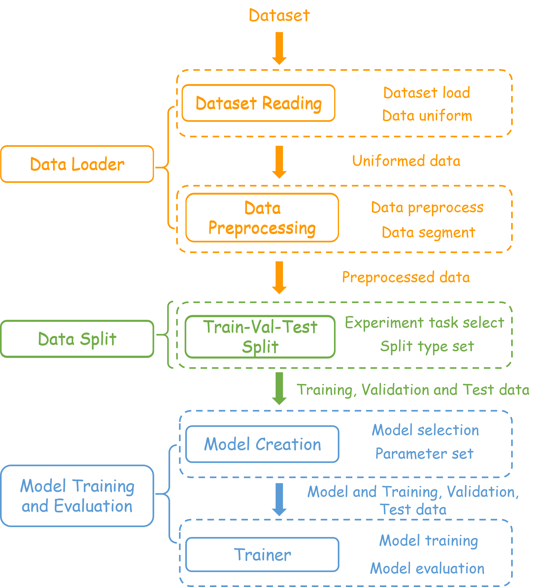

# LibEER: A Comprehensive Benchmark and Algorithm Library for EEG-based Emotion Recognition
Paper Link:[[2410.09767] LibEER: A Comprehensive Benchmark and Algorithm Library for EEG-based Emotion Recognition](https://arxiv.org/abs/2410.09767)
## Project Description
LibEER estabilshes a unified evaluation framework with standardized experimental settings, enabling unbiased evaluations of over representative deep learning-based EER models across the four most commonly used datasets.
- **Standardized Benchmark**: LibEER provides a unified benchmark for fair comparisons in EER research, addressing inconsistencies in datasets, settings, and metrics, making it easier to evaluate various models.
- **Comprehensive Algorithm Library**: The framework includes implementations of over ten deep learning models, covering a wide range of architectures (CNN, RNN, GNN, and Transformers), making it highly versatile for EEG analysis.
- **Efficient Preprocessing and Training**: LibEER offers various preprocessing techniques and customizable settings, enabling efficient model fine-tuning, lowering the entry barrier for researchers, and boosting research efficiency.
- **Extensive Dataset Support**: LibEER gives standardized access to major datasets like SEED, SEED-IV, DEAP, and MAHNOB-HCI, supporting both subject-dependent and cross-subject evaluations, with plans to add more datasets in the future.
## Installation
To run this project, you'll need the following dependencies:
1. Python 3.x recommended
2. Dependencies: You can install the required Python packages by running:
```cmd
pip install -r requirements.txt
```
### pip
To install the LibEER by pip, please use the following command, all reproduced models have been integrated, easily for direct use. Please refer to chapter use model via pip for more information.
```cmd
pip install LibEER
```

## LibEER Usage

LibEER implements three main modules: data loader, data splitting, and model training and evaluation. It also incorporates many representative algorithms in the field of EEG-based Emotion Recognition. The specific usage is detailed as follows. Additionally, to make it easier for users, we have implemented several one-step methods for common data processing and data splitting tasks. All reproduced models have corresponding main files named `$MODEL_NAME$_train.py` for reference.. For more details, please refer to the quick start of this chapter.

### Quick Start
To facilitate easy use for users, we implemented the **Setting** class, allowing one-stop data usage through parameter configuration. Additionally, we have preconfigured many common experimental settings to help users quickly get started. 
Data is achieved through the **Setting** class:
```python
import torch  
import torch.optim as optim  
import torch.nn as nn

from config.setting import Setting  
from Trainer.training import train
from models.Models import Model
from models.DGCNN import NewSparseL2Regularization
from data_utils.load_data import get_data  
from data_utils.split import merge_to_part, index_to_data, get_split_index
from utils.utils import result_log,


setting = Setting(dataset='deap',  
                  dataset_path='DEAP/data_preprocessed_python',  
                  pass_band=[0.3, 50],  
                  extract_bands=[[0.5,4],[4,8],[8,14],[14,30],[30,50]],   
                  time_window=1,   
                  overlap=0,  
                  sample_length=1,   
                  stride=1,   
                  seed=2024,   
                  feature_type='de_lds',   
                  only_seg=False,   
                  experiment_mode="subject-dependent",  
                  split_type='train-val-test',   
                  test_size=0.2,   
                  val_size=0.2)
data, label, channels, feature_dim, num_classes = get_data(setting)
data, label = merge_to_part(data, label, setting)
for rridx, (data_i, label_i) in enumerate(zip(data, label), 1):  
    tts = get_split_index(data_i, label_i, setting)  
    for ridx, (train_indexes, test_indexes, val_indexes) in enumerate(zip(tts['train'], tts['test'], tts['val']), 1):  
	    train_data, train_label, val_data, val_label, test_data, test_label = \  
    index_to_data(data_i, label_i, train_indexes, test_indexes, val_indexes, args.keep_dim)
		model = Model['DGCNN'](channels, feature_dim, num_classes)  
	    # Train one round using the train one round function defined in the model  
        dataset_train = torch.utils.data.TensorDataset(torch.Tensor(train_data), torch.Tensor(train_label))  
        dataset_val = torch.utils.data.TensorDataset(torch.Tensor(val_data), torch.Tensor(val_label))  
        dataset_test = torch.utils.data.TensorDataset(torch.Tensor(test_data), torch.Tensor(test_label))  
        optimizer = optim.AdamW(model.parameters(), lr=args.lr, weight_decay=1e-4, eps=1e-4)  
        criterion = nn.CrossEntropyLoss()  
        loss_func = NewSparseL2Regularization(0.01).to(device)  
        round_metric = train(model=model, dataset_train=dataset_train, dataset_val=dataset_val, dataset_test=dataset_test, device=device,  
                             output_dir=output_dir, metrics=args.metrics, metric_choose=args.metric_choose, optimizer=optimizer,  
                             batch_size=args.batch_size, epochs=args.epochs, criterion=criterion, loss_func=loss_func, loss_param=model)  
        best_metrics.append(round_metric)  
    result_log(args, best_metrics)
```
Data also can be achieved by preset setting by:
```python
from config.setting import seed_sub_dependent_train_val_test_setting
data, label, channels, feature_dim, num_classes = get_data(setting)
...
```
Currently supported prset setting can be found in [Preset Setting in LibEER](docs/PresetSetting.md)

### Detailed usage
To enable users to have more precise control and use of intermediate results, this section presents the detailed usage of the three main modules. If the settings class does not meet the requirements of your experiment, you can refer to the usage methods below.
#### Data loader
In the data loader, LibEER supports four EEG emotion recognition datasets: SEED, SEED-IV, DEAP, and HCI. It also provides support for various data preprocessing methods and a range of feature extraction techniques. The following example demonstrates how to use LibEER to load a dataset and preprocess the data. Specifically, it extracts 1-second DE (Differential Entropy) features from the DEAP dataset, after baseline removal and band-pass filtering between 0.3-50Hz, across five frequency bands.
```python
# get data, baseline, label, sample rate of data,  channels of data using get_uniform_data() function  
unified_data, baseline, label, sample_rate, channels = get_uniform_data(dataset="deap", dataset_path="DEAP/data_preprocessed_python")
# remove baseline  
data = baseline_removal(unified_data, baseline)  
# using a 0.3-50 Hz bandpass filter to process the data  
data = bandpass_filter(data, sample_rate,  pass_band=[0.3, 50])  
# a 1-second non-overlapping preprocess window to extract de_lds features on specified extract bands  
data = feature_extraction(data, sample_rate, extract_bands=[[0.5,4],[4,8],[8,14],[14,30],[30,50]] , time_window=1, overlap=0, feature_type="de_lds") 
# sliding window with a size of 1 and  a step size of 1 to segment the samples.  
data, feature_dim = segment_data(data, sample_length=1, stride=1)
# data format: (session, subject, trail, sample)
```
#### Data Split
In LibEER, the Data Split module is mainly responsible for data partitioning under different experimental tasks and split settings. It supports three mainstream experimental tasks: subject-dependent, cross-subject, and cross-session, and offers various data splitting methods. The following example demonstrates how to split the dataset into training, validation, and testing sets in a subject-dependent task, with a ratio of 0.6, 0.2, and 0.2, respectively.
```python
from data_utils.split import merge_to_part
data, label = merge_to_part(data, label, experiment_mode="subject_dependent") 
# further split each subject's subtask  
for idx, (data_i, label_i) in enumerate(zip(data,label)):  
    # according to the data format and label,  the test size is 0.2 and the validation size is 0.2   
    spi = get_split_index(data_i, label_i,  split_type="train-val-test", test_size=0.2, val_size=0.2)  
    for jdx, (train_indexes, test_indexes, val_indexes) in enumerate(zip(spi['train'],spi['test'], spi['val'])):  
        # organize the data according to the resulting index  
        (train_data, train_label, val_data, val_label,  test_data, test_label) = index_to_data(data_i, label_i,  train_indexes, test_indexes, val_indexes)
```

#### Model training and evaluation
LibEER supports various mainstream emotion recognition methods. For details, please refer to the Support Methods section. We selected DGCNN for training and testing.
```python
from models.Models import Model
from Trainer.training import train
model = Model['DGCNN'](num_electrodes=channels, feature_dim=5,  num_classes=3, k=2, layers=[64], dropout_rate=0.5)  
# train and evaluate model, then output the metric  
round_metric = train(model,train_data,train_label,val_data,val_label,test_data,test_label)
```
## Use the Model via pip
If you are only interested in the reproduced model, install the LibEER via pip and see the following instructions.
```python
import LibEER.models.MsMda as MsMda
# use the training method provided by LibEER or yours
import LibEER.Trainer.msmdaTrain as train
model = MsMda(channels, feature_dim, num_classes, number_of_source=samples_source)
# result dicts
round_metric = train(model=model, datasets_train=datasets_train, dataset_val=dataset_val, dataset_test=dataset_test, output_dir=output_dir, samples_source=samples_source, device=device, metrics=args.metrics, metric_choose=args.metric_choose, optimizer=optimizer,

                                 batch_size=args.batch_size, epochs=args.epochs, criterion=criterion)
```
## Supported Dataset
- [seed](https://bcmi.sjtu.edu.cn/home/seed/seed.html)
- [seediv](https://bcmi.sjtu.edu.cn/home/seed/seed-iv.html)
- [deap](https://www.eecs.qmul.ac.uk/mmv/datasets/deap/)
- [hci](https://mahnob-db.eu/hci-tagging/)
## Supported Methods
### DNN methods
- [Ms-mda](https://www.frontiersin.org/journals/neuroscience/articles/10.3389/fnins.2021.778488/full)
- [DBN](https://ieeexplore.ieee.org/document/6890166)
### CNN methods
- [EEGNet](https://iopscience.iop.org/article/10.1088/1741-2552/aace8c)
- [CDCN](https://ieeexplore.ieee.org/document/9011570)
- [Tsception](https://ieeexplore.ieee.org/document/9762054)
### GNN methods
- [DGCNN](https://ieeexplore.ieee.org/document/8320798)
- [RGNN](https://ieeexplore.ieee.org/document/9091308)
- [GCB-Net](https://ieeexplore.ieee.org/document/8815811)
### RNN methods
- [ACRNN](https://ieeexplore.ieee.org/abstract/document/9204431)
- [BiDANN](https://ieeexplore.ieee.org/document/8567966)
- [R2G-STNN](https://ieeexplore.ieee.org/document/8736804)
### Transformer methods
- [HSLT](https://www.sciencedirect.com/science/article/abs/pii/S0893608024005483)
## Citations
```
@inproceedings{liu2024libeercomprehensivebenchmarkalgorithm,
      title={LibEER: A Comprehensive Benchmark and Algorithm Library for EEG-based Emotion Recognition}, 
      author={Huan Liu and Shusen Yang and Yuzhe Zhang and Mengze Wang and Fanyu Gong and Chengxi Xie and Guanjian Liu and Dalin Zhang},
      year={2024},
      eprint={2410.09767},
      archivePrefix={arXiv},
      primaryClass={cs.HC},
      url={https://arxiv.org/abs/2410.09767}, 
}
@article{Liu2024EEGBasedME, title={EEG-Based Multimodal Emotion Recognition: A Machine Learning Perspective}, author={Huan Liu and Tianyu Lou and Yuzhe Zhang and Yixiao Wu and Yang Xiao and Christian S. Jensen and Dalin Zhang}, journal={IEEE Transactions on Instrumentation and Measurement}, year={2024}, volume={73}, pages={1-29}, url={https://api.semanticscholar.org/CorpusID:267978819} }
```
